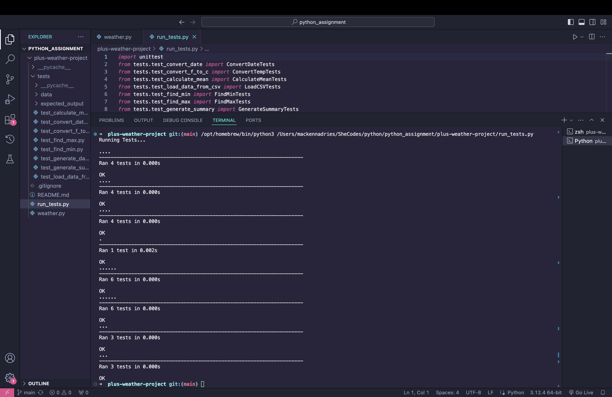

# Plus Weather Project Mackenna Dries

Here is my solution to the methods!

## DONE

- [x] Implement the methods in `weather.py`.
- [x] Verify that everything works as intended by running the tests with `python run_tests.py`.

# SCREENSHOTS 
